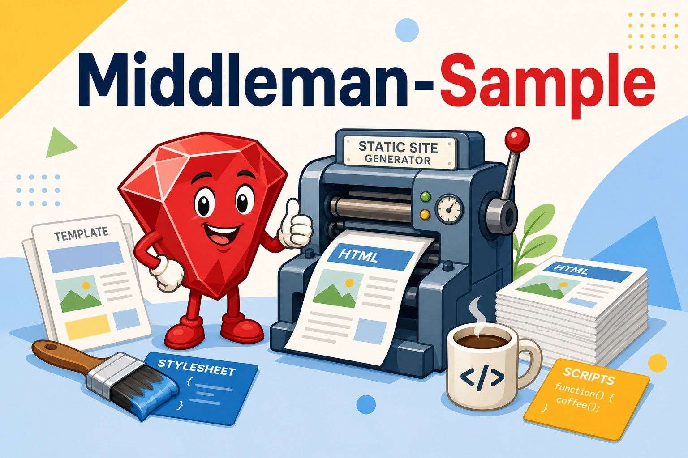

# Middleman-Sample

   



A minimal sample project for the [Middleman](https://middlemanapp.com) static site generator (v4.1, 2017), preconfigured to use Slim templates, Sass (via Compass), and CoffeeScript instead of the default ERB stack.

> **Note:** This is a legacy starter sample from 2017. The pinned gem versions (Middleman 4.1.9, middleman-compass, CoffeeScript) are outdated; treat it as a reference, not a base for new projects.

## Features

- Slim templating with custom shortcut configuration (`#` → div id, `.` → div class, `&` → input type)
- Sass/SCSS stylesheets with Compass and a bundled `_normalize.scss`
- CoffeeScript for JavaScript sources
- LiveReload enabled in development
- Layout split into `_header` / `_footer` partials

## Requirements

- Ruby with Bundler
- Gems as pinned in `Gemfile.lock` (Middleman 4.1.9 era — modern Rubies may need version updates)

## Usage

```sh
bundle install
bundle exec middleman server   # dev server with LiveReload
bundle exec middleman build    # static build into build/
```

## Project Structure

```
config.rb                 # Middleman config (Slim options, livereload)
source/
  index.html.slim         # top page
  sample.html.slim        # sample page
  layouts/                # layout.slim, sample.slim, _header/_footer partials
  stylesheets/            # site.css.scss, _normalize.scss
  javascripts/            # all.js.coffee
  images/
```
